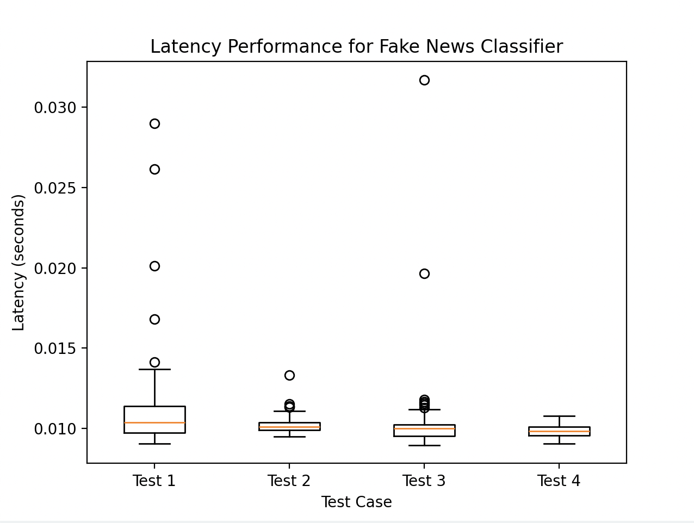

# E444-F2024-PRA5

In this PRA, we deployed an ML model to detect Fake News on AWS Beanstalk.

Note: To zip the files and upload to Beanstalk, run in command line:
`zip -d ECE444.zip __MACOSX/\*`

### Run Tests

Run this command to test the model:
`python -m pytest -s test_classifier.py`

A sample latency_results.csv is available
The boxplot generated is this:

